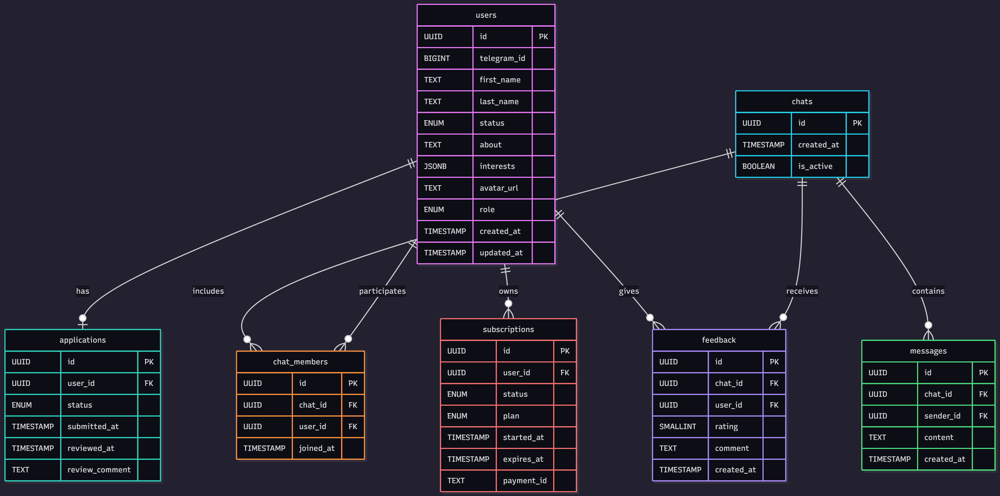

# ER‑диаграмма Silent Circle

## Назначение
Эта схема описывает структуру базы данных проекта **Silent Circle** (MVP).  
Она служит основой для Alembic‑миграций и разработки моделей SQLAlchemy.

---

## Таблицы и связи

### users
- `id` (UUID, PK)
- `telegram_id` (BIGINT, unique)
- `first_name` (TEXT)
- `last_name` (TEXT)
- `status` (ENUM: student / worker / entrepreneur / researcher)
- `about` (TEXT, nullable)
- `interests` (JSONB, nullable)
- `avatar_url` (TEXT, nullable)
- `role` (ENUM: user / admin / moderator, default=user)
- `created_at` (TIMESTAMP, default=now)
- `updated_at` (TIMESTAMP)

### applications
- `id` (UUID, PK)
- `user_id` (FK → users.id, unique)
- `status` (ENUM: pending / approved / rejected)
- `submitted_at` (TIMESTAMP)
- `reviewed_at` (TIMESTAMP, nullable)
- `review_comment` (TEXT, nullable)

### chats
- `id` (UUID, PK)
- `created_at` (TIMESTAMP, default=now)
- `is_active` (BOOLEAN, default=true)

### chat_members
- `id` (UUID, PK)
- `chat_id` (FK → chats.id)
- `user_id` (FK → users.id)
- `joined_at` (TIMESTAMP, default=now)

### messages (опционально, если чат встроенный)
- `id` (UUID, PK)
- `chat_id` (FK → chats.id)
- `sender_id` (FK → users.id)
- `content` (TEXT, encrypted)
- `created_at` (TIMESTAMP, default=now)

### feedback
- `id` (UUID, PK)
- `chat_id` (FK → chats.id)
- `user_id` (FK → users.id)
- `rating` (SMALLINT, 1–5)
- `comment` (TEXT, nullable)
- `created_at` (TIMESTAMP, default=now)

### subscriptions
- `id` (UUID, PK)
- `user_id` (FK → users.id)
- `status` (ENUM: trial / active / expired / canceled)
- `plan` (ENUM: monthly / half_year / yearly)
- `started_at` (TIMESTAMP)
- `expires_at` (TIMESTAMP)
- `payment_id` (TEXT, nullable)

---

## Связи

- `users` **1:1** `applications`
- `users` **1:N** `subscriptions`
- `users` **N:M** `chats` через `chat_members`
- `chats` **1:N** `messages`
- `chats` **1:N** `feedback`
- `users` **1:N** `feedback` (пользователь может оставить отзыв на чат)

---

## Визуализация

> Диаграмма ниже использует [Mermaid](https://mermaid.js.org/).  
> Она отображается как изображение в VS Code (с расширением), GitLab, Obsidian и других поддерживаемых средах.  
> На GitHub отображается как код — поэтому также рекомендуется сохранить скриншот.



### Mermaid (ERD)

```mermaid
erDiagram
    users ||--o| applications : "has"
    users ||--o{ chat_members : "participates"
    chats ||--o{ chat_members : "includes"
    chats ||--o{ messages : "contains"
    chats ||--o{ feedback : "receives"
    users ||--o{ feedback : "gives"
    users ||--o{ subscriptions : "owns"

    users {
        id
        telegram_id
        first_name
        last_name
        status
        about
        interests
        avatar_url
        role
        created_at
        updated_at
    }

    applications {
        id
        user_id
        status
        submitted_at
        reviewed_at
        review_comment
    }

    chats {
        id
        created_at
        is_active
    }

    chat_members {
        id
        chat_id
        user_id
        joined_at
    }

    messages {
        id
        chat_id
        sender_id
        content
        created_at
    }

    feedback {
        id
        chat_id
        user_id
        rating
        comment
        created_at
    }

    subscriptions {
        id
        user_id
        status
        plan
        started_at
        expires_at
        payment_id
    }